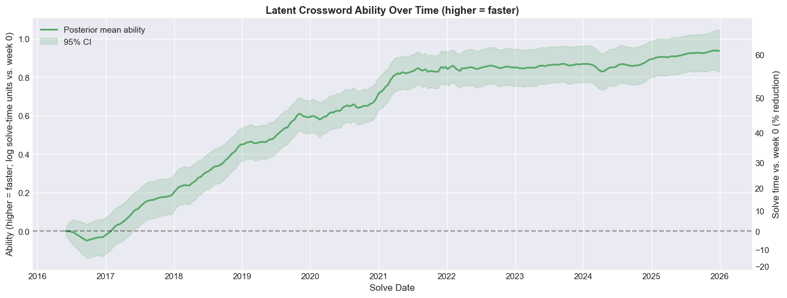

I have been a diligent solver of the [NYT daily crosswords](https://www.nytimes.com/crosswords) for over 10 years now. 

I was introduced to American style crosswords during my Ann Arbor days with the [daily crossword in the Michigan Daily](https://games.michigandaily.com/). I subscribed to New York Times and started solving their crosswords in 2016. I was able to solve the early-week puzzles (Mon-Wed) reasonably well but struggled with late-week puzzles. In an attempt to get better at the Fri/Sat themeless puzzles, I started solving some puzzles from the archives.

At some point, this turned into a methodical process where, in addition to solving the day's xword, I would also solve a couple from the archive. And, one fateful day, the thought came unbidden into my head that I should solve _all_ the puzzles available in the archive before my 40th birthday (which was then a couple of years away). And the rest, as they say, is history!!!

Between these archival solves and the daily ones, I now have a dataset of nearly 12,000 solved puzzles. This project is an attempt to track how my crossword solving time has evolved over the years and learn some regression modeling in the process.

### A peek at the results

I am happy to report that I am nearly 60% faster on average than I was when I started solving crosswords. Read on to find out how I estimated this and how we can mathematically show that a Sunday crossword is just a Thursday crossword but bigger and why [Brad Wilber](https://www.xwordinfo.com/Author/Brad_Wilber) is the constructor I find the most difficult. 
